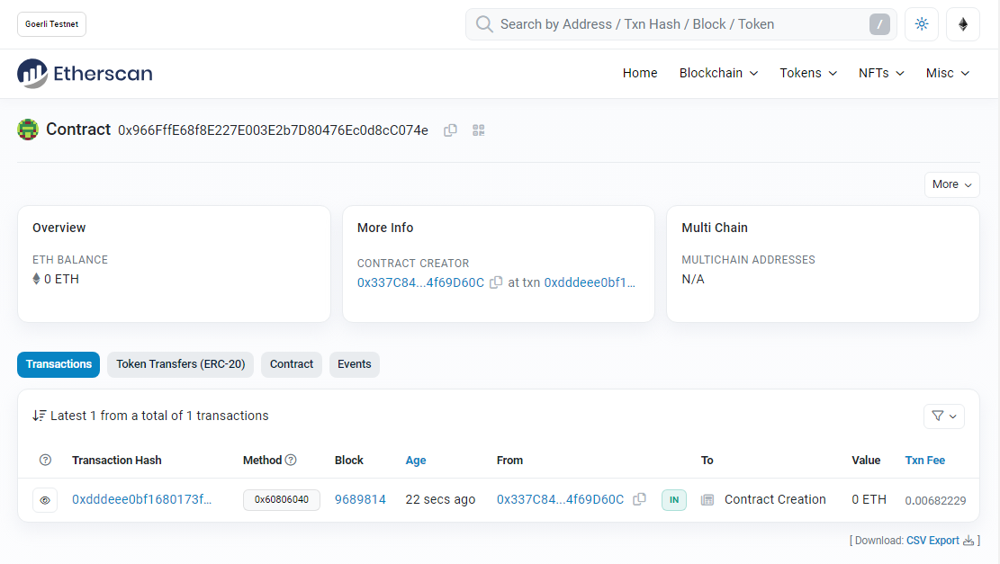

# DIO - Blockchain Specialist Training

Project Challenge - Create your Pokémon NFT with Blockchain

## How to Run 🏃

1. open https://remix.ethereum.org
2. create a new PokeDIO.sol file
3. copy and paste the content from repo
4. compile & deploy
5. test

Contract published on [Goerli](https://goerli.etherscan.io/address/0x966fffe68f8e227e003e2b7d80476ec0d8cc074e)

    

## License 📄

Code released under the [MIT License](./LICENSE).

Make by [Leonardo Cairo](https://www.linkedin.com/in/leocairos/)!# dio-blockchain-specialist-training-nft
